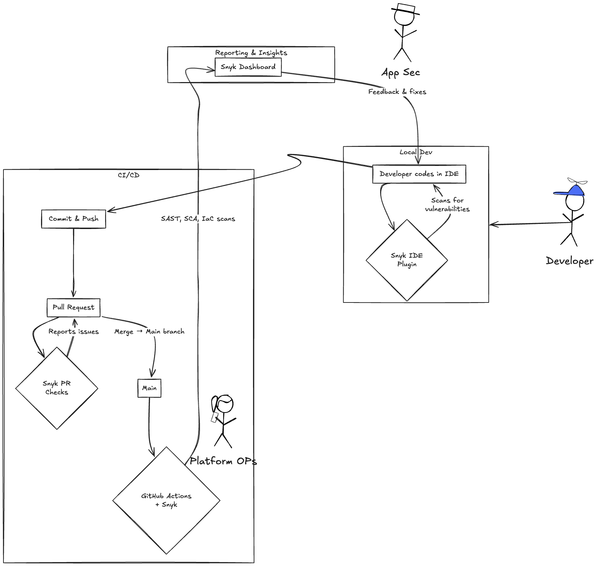
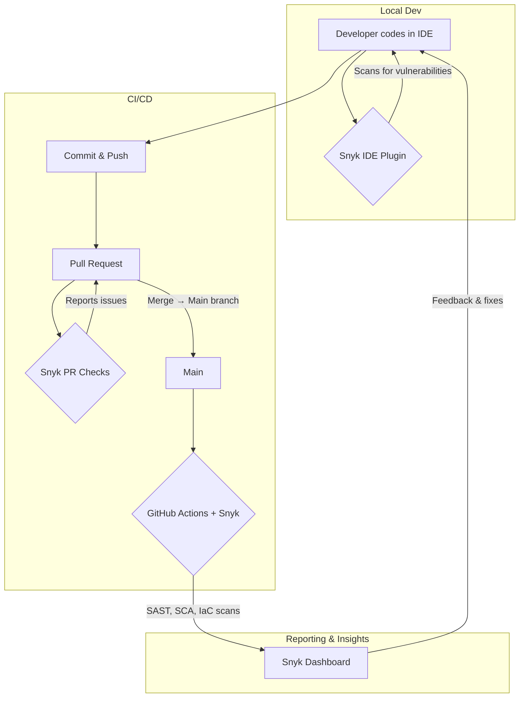

# Intentionally Vulnerable Contacts Demo Application

> A Spring Boot REST API intentionally designed with security flaws to showcase Snyk’s full lifecycle scanning capabilities.


---

## 🔖 Table of Contents

1. [Features](#features)
2. [Prerequisites](#prerequisites)
3. [Installation & Running](#installation--running)
4. [Development & Snyk Workflow](#development--snyk-workflow)
5. [Architecture Diagram](#architecture-diagram)
6. [API Endpoints](#api-endpoints)
7. [Vulnerability Demos](#vulnerability-demos)
8. [Code Quality Smells](#code-quality-smells)
9. [Snyk Scans](#snyk-scans)
10. [Contributing](#contributing)
11. [License](#license)

---

## 🌟 Features

- **Intentionally vulnerable**: Includes SQL Injection, RCE, Path Traversal, XSS, SSRF, Insecure Deserialization, XXE, SpEL/JNDI injection, and more.
- **Code quality smells**: Magic numbers, empty catches, resource leaks, dead code, hard-coded secrets, etc.
- **Snyk integration**: Works with IDE plugins, CLI, GitHub PR checks, and Actions.

---

## 🛠 Prerequisites

- **Java 21 JDK**
- **Maven 3.6+**
- (Optional) Docker & Kubernetes CLI
- **Snyk CLI** ([install instructions](https://snyk.io/))
- **Snyk IDE Plugin** (VS Code, IntelliJ, Eclipse, etc.)
- **Snyk GitHub App** configured on this repo

---

## 🚀 Installation & Running

```bash
# Build
mvn clean package

# Run locally
mvn spring-boot:run
```

> The service will listen on port **9090** by default.

---

## ⚙️ Development & Snyk Workflow



---

## 📡 API Endpoints

### Contacts (Normal CRUD)

| Method | Endpoint               | Description                                      |
| ------ | ---------------------- | ------------------------------------------------ |
| GET    | `/contacts`            | List all contacts                                |
| POST   | `/contacts`            | Create a new contact<br>`{ name, email, phone }` |
| GET    | `/contacts/{id}`       | Retrieve contact by ID                           |
| PUT    | `/contacts/{id}`       | Update all fields of a contact                   |
| PATCH  | `/contacts/{id}`       | Partial update (e.g., email)                     |
| DELETE | `/contacts/{id}`       | Delete a contact                                 |

---

## 🔓 Vulnerability Demos

All under `/vuln/*`:

- **SQL Injection**: `GET /vuln/search?q=<name>`
- **RCE / OS Command Injection**: `GET /vuln/exec?cmd=<shell>`
- **Path Traversal**: `GET /vuln/read-file?path=<file>`
- **Insecure Deserialization**: `POST /vuln/deserialize`
- **SSRF**: `GET /vuln/fetch?url=<remote_url>`
- **Reflected XSS**: `GET /vuln/xss?msg=<payload>`

### Advanced Demos (`/adv/vuln/*`)
- **XXE**: `POST /adv/vuln/xxe`
- **SpEL Injection**: `GET /adv/vuln/spel?exp=<spel>`
- **JNDI Injection**: `GET /adv/vuln/jndi?name=<jndiUrl>`
- **Unsafe Reflection**: `GET /adv/vuln/reflect?className=<class>`

---

## 🛠️ Code Quality Smells

Under `/quality/*`, find examples of:
- Magic numbers, duplicate code, empty catches
- Resource leaks, blocking calls, too many parameters
- Mutable statics, dead code, hard-coded AWS credentials

---

## 🔍 Snyk Scans

1. **Snyk Code (SAST)**
   ```bash
   snyk code test
   ```
2. **Snyk Open Source (SCA)**
   ```bash
   snyk test
   ```
3. **Snyk IaC**
   ```bash
   snyk iac test Dockerfile k8s/**/*.yaml
   ```

> Integrate each into your IDE, CLI, GitHub PRs, and Actions for continuous monitoring.

---

## 🤝 Contributing

1. Fork the repository
2. Create a feature branch
3. Make your changes
4. Open a pull request

Please include tests or demo scenarios for any new vulnerability or feature.

---

## 📜 License

This project is released under the [MIT License](LICENSE).
